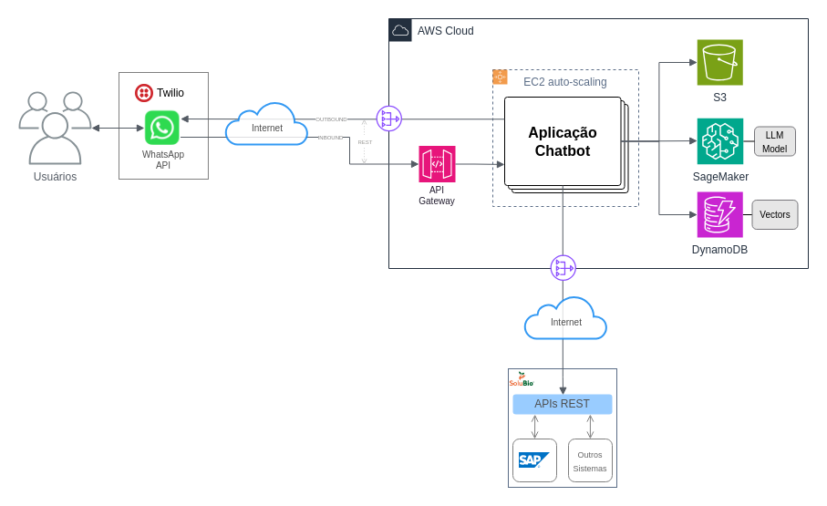

# Solução de Chatbot Inteligente - Solubio

## Membros do Grupo 35

* Jose Antonio Correa Junior (RM 559800)
* Gabriel de Oliveira Soares Ribeiro (RM 560173)
* Marcos de Souza Trazzini (RM 559926)
* Jonas Felipe dos Santos Lima (RM 560461)
* Edimilson Ribeiro da Silva (RM 559645)

## Desenho da Arquitetura da Solução



## Sobre a Arquitetura

A arquitetura que estamos propondo para o desafio visa atender e superar os requisitos e objetivos apresentados, por meio de uma combinação estratégica de tecnologias modernas, inovadoras e que possam fornecer um equilíbrio ideal entre desempenho, funcionalidades e custo, para que seja uma solução sustentável economicamente, permitindo com que a Solubio seja bem sucedida na sua escalada para o sucesso digital junto aos seus clientes.

## Objetivos

Ao propormos esta solução, nossa maior preocupação foi atender e **SUPERAR** os objetivos de negócio apresentados pela Solubio, da melhor forma que entemos que seja uma solução ideal e bem ajustada. 

Tendo isso posto, elencamos aqui os objetivos apresentados pela Solubio e o nosso entendimento:

1. __Escalada para o SUCESSO DIGITAL junto aos nossos clientes__
    Aqui entendemos que a Solubio está embarcada em uma jornada de transformação digital, que vai além apenas desse chatbot, mas envolve toda uma criação de percepção de valor digital, construída ao longo do tempo.

2. __Tornar a experiência do CLIENTE agradável e eficiente__
    É importante valorizar e se preocupar com a percepção de qualidade e experiência de usuário dos seus clientes. Isso também deve levar em consideração o perfil dos clientes da Solubio (produtores rurais de todos os portes, espalhados por todo o território nacional), e ter isso cuidadosamente em conta durante o processo de criação, testes e validação das experiências dos clientes em todos os pontos de interação com o Chatbot.
    Aqui existe um desafio inerente, pois o perfil dos clientes da Solubio prefere contato com humanos, geralmente por voz, enquanto o chatbot é uma automação sintética. Sendo assim, tomamos como objetivo uma cuidadosa atenção com a experiência do usuário, que visa desconstruir essa estigma de má experiência com atendimentos automatizados, como URAs e Chatbots, de forma que, com o passar do tempo, os clientes da Solubio passem a aderir cada vez mais os canais digitais de atendimento e auto-serviço.

3. __Reduzir o tempo de resposta__
    Com uma experiência de interação muito bem curada e cuidadosamente refinada para atender as expectativas dos clientes, é natural que o tempo de resposta (ou seja, o tempo médio que um cliente leva para obter uma resposta para a sua solicitação) seja reduzido. De acordo com uma pesquisa feita pela OTRS Group (“OTRS Spotlight: IT Service Management 2024”), chatbots inteligentes como este são capazes de reduzir em até 75% o tempo médio de interação com o cliente, ao passo que também aumenta 74% a qualidade no atendimento ao cliente. 

4. __Ter qualidade nos retornos__
    Com inúmeros eventos ocorrendo todo o tempo nas interações entre a Solubio e seus clientes (como entregas de produtos, visitas e cobranças), existe um desafio grande para garantir que as notificações adequadas cheguem aos usuários no momento correto. Além disso, existe também a preocupação de que as respostas dadas pelo Chatbot sejam assertivas e atualizadas.

## Premissas Importantes

1. Como até o momento não existe uma clara definição sobre como os dados e serviços serão efetivamente disponibilizados para consumo do Chatbot, estamos considerando que serão todos disponibilizados via uma API REST, acessível via Internet. Esta API poderá ser simulada durante o desenvolvimento da solução, em ambiente acadêmico, mas tenhamos em mente que, caso a Solubio deseje colocar a solução em produção, este ponto precisará ser discutido.

2. Nosso projeto, em ambiente acadêmico, utilizará ferramentas e tecnologias que podem ser diferentes das que eventualmente a Solubio decida utilizar em seu ambiente. Sendo assim, é importante mencionar que alterações no desenho da solução e estimativas de custos serão necessárias em uma eventual transição para o ambiente da Solubio.

3. Como não foram disponibilizadas informações precisas de volumetria, estamos assumindo um volume médio de 50 mil mensagens por mês.

4. Para efeitos de cálculos de estimativas de custos, foram considerados os valores publicamente listados em cada fornecedor, mas estes valores tendem a reduzir bastante em negociações contratuais ligadas a compromissos de consumo.


## Elementos

### Twilio e API WhatsApp

A [Twilio](https://www.twilio.com) é uma solução em nuvem que permite com que aplicações se integrem em canais de comunicação como WhatsApp, SMS, Voz e e-mail através de APIs REST, abstraindo toda a complexidade por trás de cada um desses canais, ao tempo que fornece uma camada de integração simplificada e padronizada para a troca de mensagens com usuários. Essa abstração é essencial para que possamos concentrar nossos esforços nos requisitos de negócio e criar a melhor solução de Chatbot possível, sem se preocupar com detalhes de implementação dos canais digitais.

Optamos por utilizar Twilio porque:

1. É a maneira mais simples e confiável de integrar uma aplicação com a API de WhatsApp da Meta. A Twilio é o maior broker oficial de WhatsApp do mundo, sendo utilizada por milhares de empresas de todos os portes.
2. Possui um modelo comercial baseado em consumo ("Pay as you go"), possibilitando uma previsibilidade de custos muito maior do que outras soluções baseadas em modelos como "pacotes de mensagens" ou horários.
3. Permite adicionar outros canais no Chatbot, como Chat (na web ou app), SMS/MMS, Google RCS, Voz, entre outros. Isso torna a solução muito mais "future-proof", garantindo flexibilidade e um excelente alinhamento entra a solução e a estratégia de escalada digital da Solubio.


### Nuvem AWS

Optamos por utilizar [Amazon Web Services](https://aws.amazon.com) por ser a solução de Nuvem com maior fatia de mercado atualmente, facilitando assim a busca por recursos especializados. Porém, a solução proposta pode ser adaptada para rodar em qualquer provedor Cloud, como Microsoft Azure ou Google Cloud.

Uma das maiores vantagens de se utilizar uma solução de Cloud como a AWS é o fato de que os componentes essenciais de infraestrutura são todos gerenciados pela AWS, e possuem um modelo comercial baseado no consumo ("Pay as you go"), possibilitando que os custos de infraestrutura acompanhem a escala do projeto, sem que seja necessário altos investimentos iniciais ("upfront").

Por mais que a Solubio não tenha posicionado o custo da solução como um dos objetivos do projeto, entendemos que a previsibilidade de custos é algo inerente de qualquer projeto moderno de tecnologia.

Apesar de ser algo independente do desenho da solução, nossa recomendação para que haja maior aderência possível às leis de proteção de dados, como a LGPD, é que seja utilizada uma região AWS no Brasil. Adicionalmente, a fim de não implicar complexidades e custos adicionais nesse primeiro desenho da solução, optamos por ter todos os componentes AWS rodando em uma única região. Porém, futuramente é possível expandir a solução para múltiplas regiões, garantindo assim níveis altíssimos de disponibilidade para a solução.


### API Gateway

Este componente concentra os endpoints de API que os callbacks da Twilio utilizarão para enviar mensagens para o chatbot. Toda mensagem recebida na API WhatsApp da Twilio gera uma chamada à nossa API, que será hospedada no API Gateway, que atua como um ponto único de entrada para esses eventos. Adicionalmente, o API Gateway faz as proteções necessárias contra eventuais tentativas de ataques DDoS ou similares, além de fornecer todo o ferramental necessário para autenticação e controles de uso da API, atuando como um "Firewall de Aplicação (camada 7)" nesse contexto.

As requisições recebidas na API são validadas e, caso estejam em conformidade, são encaminhadas de maneira distribuída para os nós ativos no cluster EC2 da aplicação Chatbot. Observe que, como o API Gateway já faz o trabalho de distribuição de requisições entre instâncias EC2 ativas no cluster a nível de aplicação/protocolo (HTTPS), não existe a necessidade de criar balanceadores de carga ELB (Enterprise Load-Balancers) para essa função, o que simplifica a arquitetura da solução.


### Aplicação Chatbot

Este é o componente central da solução, e possui a lógica principal do Chatbot. É uma aplicação escrita em Python, que utiliza Flask para expor os endpoints de API para interação com o Chatbot, e LangChain para criar a cadeia (chain) de comunicação do Chatbot, além de outras bibliotecas para interação com as APIs REST da Solubio e componentes AWS (S3, SageMaker e DynamoDB).

Optamos por externalizar o modelo de IA generativa em um serviço dedicado a esse propósito (AWS SageMaker), que possui todos os recursos computacionais necessários, de maneira distribuída e consumida como serviço, para o funcionamento fluído do Chatbot. A utilização de um modelo local iria demandar alto poder de processamento nos nós do cluster EC2, o que tornaria a solução financeiramente inviável.

#### Funcionamento

Antes mesmo de entrar em funcionamento, o modelo de IA Generativa é cuidadosamente treinado com exemplos de prompts para todos os cenários previstos de atendimento, além de passar por um processo de enriquecimento de conhecimento via RAG (Retrieval Augmented Generation), a fim de garantir uma comunicação fluída e mais previsível, evitando ao máximo as conhecidas "alucinações" das aplicações de IA Generativa mais genéricas. A grosso modo, é assim que daremos "alma" à Dra Jô.

No fluxo geral, para mensagens entrantes (inbound), ou seja, enviadas pelos clientes via WhatsApp/Twilio, a plataforma da Twilio gera um evento (callback) em formato de requisição REST para o API Gateway, que encaminha a requisição para um dos nós da aplicação Chatbot. Ao receber essa requisição, o Chatbot consulta o banco de dados (DynamoDB) em busca de informações anteriores que possam dar contexto à essa conversa, permitindo assim que as conversas tenham continuidade mesmo que as requisições de mensagens sejam distribuídas entre os nós do cluster.

A cadeia (chain) é inicializada no LangChain (com ou sem contexto prévio), e a mensagem do cliente é então formatada e enviada para o modelo, no AWS SageMaker, para processamento. Ao receber uma resposta, a aplicação utiliza o encadeamento (chaining) necessário via LangChain para formatar uma resposta para o cliente, e salva todo o histórico no banco a cada mensagem trocada.

Em alguns casos, para que seja possível formatar uma resposta adequada para o usuário (Ex: "emissão de boleto"), após a inteligência do modelo identificar a intenção do cliente, a aplicação de Chatbot fará uma requisição na API REST da Solubio a fim de obter as informações necessárias, e ao receber uma resposta da API, utiliza as informações para formatar uma mensagem de resposta para o usuário, com base nesses dados. Adicionalmente, a aplicação Chatbot será programada para tratar eventuais erros (Ex: problema ao acessar a API REST da Solubio) e dar um retorno adequado ao usuário.

Em situações onde o Chatbot precisar enviar arquivos inteiros (como documentos PDF), será utilizado o AWS S3 para obter o arquivo previamente adicionado no repositório, e o mesmo é anexado na resposta.

Para envios ativos, onde o Chatbot inicia a conversa, consideramos que a Solubio fará uma chamada via API à Solução de Chatbot, que enviará a mensagem de acordo com os parâmetros fornecidos. Futuramente, é possível implementar a funcionalidade de carga de listas de envio diretamente na plataforma, mas optamos por não incluir esse requisito por enquanto, visto que a Solubio não demonstrou interesse na funcionalidade, e há muito mais valor agregado no envio pontual de mensagens (que ocorrem em eventos específicos, como uma atualização de status de entrega de um produto). 

#### Modelo de Escalabilidade

Optamos por utilizar um cluster EC2, com o recurso de ASG (Auto-Scaling Group) configurado, de forma que os nós do cluster são automaticamente provisionados e de-provisionados de acordo com a demanda momentânea do cluster, a fim de garantir escalabilidade em momentos de pico de requisição, ao mesmo tempo que economiza recursos ao reduzir a quantidade de nós ativos em momentos de baixa demanda.

Para evitar que eventuais problemas de configuração ou picos de requisição muito além do esperado, além dos mecanismos de segurança que existem no API Gateway, o cluster EC2 também será configurado com um limite máximo de recursos, evitando assim que altos custos inesperados com infraestrutura de nuvem ocorram. 


### AWS S3

Utilizaremos o AWS S3 como um repositório para documentos estáticos que poderão ser utilizados para treinamento (RAG) do modelo de IA ou para situações onde o Chatbot precise enviar arquivos estáticos para os usuários durante a troca de mensagens.


### AWS Sagemaker

O AWS SageMaker é um componente crítico da nossa solução, pois nele será hospedado o modelo de IA generativa (que identifica as intenções dos usuários com base nas mensagens enviadas e "gera" as respostas) e o modelo responsável por gerar as "embeddings" no processo conhecido como RAG, que fará a vetorização de documentos para aumentarmos o conhecimento da Dra Jô. 

Um dos motivos de optarmos pelo SageMaker é o fato de ser uma ferramenta especializada na hospedagem e processamento de modelos de IA como serviço, possuindo todo o poderio computacional necessário para a tarefa. Conforme explicado acima, a execução local do modelo (diretamente nas instâncias EC2) inviabilizaria financeiramente a solução, devido à necessidade de alto poder de processamento.

Outro motivo importante é que a externalização do modelo nos permite trocar de modelo facilmente, permitindo otimizar a solução com modelos que melhor atendam os requisitos futuramente. Utilizaremos o modelo open source `llama3.1`, inicialmente, pelo seu baixo custo e um bom desempenho para essa tarefa. 


### AWS DynamoDB

Este é o banco de dados da solução, responsável por armazenar todo o histórico de mensagens trocadas, metadados e os vetores utilizados pelo modelo de IA para a execução de fluxos RAG.

Optamos pelo DynamoDB por ser uma solução totalmente serverless, que acompanha a evolução da solução e não exige muita gestão, se comparado a um banco de dados relacional convencional no RDS. Além disso, o DynamoDB escala automaticamente conforme a demanda, alinhando com a proposta de escalabilidade do restante da solução.


### NAT Gateways

A função dos NAT Gateways é fornecer um ponto de saída para a Internet que alguns serviços possam utilizar, sem que haja a necessidade de alocação de IPs "Públicos" para estes componentes. Por exemplo, as próprias instâncias EC2 da Aplicação de Chatbot estão em uma VPC Privada na AWS, e não possuem endereços públicos de IP. Desta forma, sempre que a aplicação necessitar acessar à Internet, será utilizada uma rota que passe por um NAT Gateway.

Existe efetivamente um único NAT Gateway na arquitetura proposta. Porém, para fins de clareza do desenho, optamos por incluir dois NAT Gateways conectando a estrutura à Internet. O primeiro deles garante que a aplicação Chatbot consiga se comunicar com a API WHatsApp da Twilio (OUTBOUND), enquanto o outro permite que a aplicação Chatbot acesse as APIS REST da Solubio via Internet.

⚠️ **Importante:** Como ainda não tivemos a oportunidade de discutir detalhes de conectividade entre a infraestrutura AWS onde será hospedada a Aplicação e a infraestrutura onde será hospedada a API REST da Solubio, estamos considerando que essa comunicação se derá via Internet, utilizando protocolos de segurança adequados. Porém, esse desenho pode mudar futuramente, sem prejuízos de funcionamento para a aplicação Charbot.


### APIs REST Solubio

Todos os dados e serviços que a aplicação Chatbot precisar consumir ocorrerão por meio de uma API REST da Solubio, criando uma camada de abstração com os sistemas de linha de negócio da Solubio e o Chatbot.


# Previsão de Custos

Esta seção contém o racional de cálculo e modelo de custo de cada componente. Para valores em dólar, utilizamos o fator de R$5,60 por dólar, para efeitos de conversão e simplificação do cálculo. Alguns seviços possuem um "free tier", mas que geralmente são temporários (apenas nos primeiros 12 meses), então decidimos não considerar essa variável nos cálculos.

Para facilitar o cálculo com parâmetros diferentes, incluímos no repositório uma calculadora em python, que calcula automaticamente as estimativas de acordo com as entradas:

```
$ python calculator.py
Estimação de Custos da Solução de Chatbot (Região: São Paulo - AWS sa-east-1)
Informe a taxa de câmbio atual (USD para BRL): 5.6
Número de conversas (24 horas cada): 5000
Número total de mensagens trocadas: 50000
Número de chamadas na API Gateway: 6000
Horas de uso de instância EC2: 1000
Armazenamento em S3 (GB): 2
Unidades de leitura/escrita DynamoDB: 4
Horas de uso do SageMaker: 200
Transferência de dados via NAT Gateway (GB): 5

*** Estimativa de Custos Detalhada ***

--- Custos Twilio ---
Twilio (Custo por Conversas): R$224.00 (Conversas: 5000 * Custo por conversa: R$0.0448)
Twilio (Custo por Mensagens): R$1400.00 (Total de mensagens: 50000 * Custo por mensagem: R$0.0280)
Total Twilio: R$1624.00

--- Custos AWS ---
API Gateway: R$0.17 (Chamadas API: 6000 * Custo por chamada: R$0.000028)
EC2 (Instâncias): R$840.00 (Horas EC2: 1000.0 * Custo por hora: R$0.84)
S3 (Armazenamento): R$0.45 (Armazenamento S3: 2.0 GB * Custo por GB: R$0.22)
DynamoDB: R$0.07 (Unidades de leitura/escrita: 4 * Custo por unidade: R$0.017)
SageMaker: R$14560.00 (Horas SageMaker: 200.0 * Custo por hora: R$72.80)
NAT Gateway: R$1.96 (Transferência NAT: 5.0 GB * Custo por GB: R$0.39)
Total AWS: R$15402.64

*** Custo Total da Solução ***
Custo Total: R$17026.64

```

## Twilio

A Twilio cobra pelas conversas e mensagens no WhatsApp da seguinte forma:

* _Custo por Conversa_: Cada nova conversa (ou sessão de 24 horas) tem um custo fixo de $0,008. Dentro desta janela, várias mensagens podem ser trocadas.
* _Custo por Mensagem_: Cada mensagem enviada ou recebida dentro de uma conversa tem um custo adicional de $0,005.

Com uma taxa de câmbio de 5,6 (USD para BRL), os cálculos são feitos da seguinte forma:

* _Cálculo do Custo das Conversas_:
    * `Custo = Número de Conversas * $0,008 * Taxa de Câmbio`
    * Aplicando os valores: 5000 conversas * 0,008 * 5,6 = R$224,00
    
* Cálculo do Custo das Mensagens:
    * `Custo = Número Total de Mensagens * $0,005 * Taxa de Câmbio`
    * Aplicando os valores: 50000 mensagens * 0,005 * 5,6 = R$1400,00
    
* Total Twilio: R$224,00 + R$1400,00 = R$1624,00

## AWS API Gateway

O API Gateway da AWS cobra por número de chamadas de API. Neste contexto, o API Gateway processa as requisições que chegam ao chatbot, redirecionando as mensagens para a aplicação.

* _Custo por chamada de API_: $0,000005 ajustado para R$0,000028 com a taxa de câmbio de 5,6.
* _Fórmula de Cálculo_:
    * `Custo = Número de Chamadas * Custo por Chamada`
    * _Aplicando os valores_: 6000 chamadas * 0,000028 = R$0,17

## AWS S3 (Armazenamento)

O Amazon S3 é utilizado para armazenar documentos e arquivos necessários para o funcionamento do chatbot, como PDFs ou outros arquivos que o chatbot pode enviar aos usuários.

* _Custo por GB armazenado_: $0,04 ajustado para R$0,22 com a taxa de câmbio de 5,6.
* _Fórmula de Cálculo_:
    * `Custo = Armazenamento em GB * Custo por GB`
    * Aplicando os valores: 2 GB * 0,22 = R$0,45

## AWS DynamoDB (Banco de Dados)

O DynamoDB armazena dados estruturados, como histórico de conversas e informações contextuais para o chatbot. A cobrança do DynamoDB é baseada nas unidades de leitura e escrita consumidas.

* _Custo por unidade de leitura/escrita_: $0,003 ajustado para R$0,017 com a taxa de câmbio de 5,6.
* _Fórmula de Cálculo_:
    * `Custo = Unidades de Leitura/Escrita * Custo por Unidade`
    * Aplicando os valores: 4 unidades * 0,017 = R$0,07

## AWS SageMaker (Modelo de IA)

O AWS SageMaker hospeda o modelo de IA que processa as mensagens e gera respostas. A cobrança do SageMaker é baseada nas horas de uso.

* _Custo por hora de uso_: $13,00 ajustado para R$72,80 com a taxa de câmbio de 5,6.
* _Fórmula de Cálculo_:
    * `Custo = Horas de Uso * Custo por Hora`
    * _Aplicando os valores_: 200 horas * 72,80 = R$14560,00

## AWS NAT Gateway

O NAT Gateway permite que instâncias privadas na VPC (Rede Virtual Privada) acessem a Internet de forma segura. A cobrança do NAT Gateway é baseada na quantidade de dados transferidos através dele.

* _Custo por GB transferido_: $0,07 ajustado para R$0,39 com a taxa de câmbio de 5,6.
* _Fórmula de Cálculo_:
    * `Custo = Transferência em GB * Custo por GB`
    * _Aplicando os valores_: 5 GB * 0,39 = R$1,96

## Resumo final dos custos

* Total Twilio: R$1624,00
* Total AWS: R$15402,64
* Custo Total da Solução: R$17026,64

